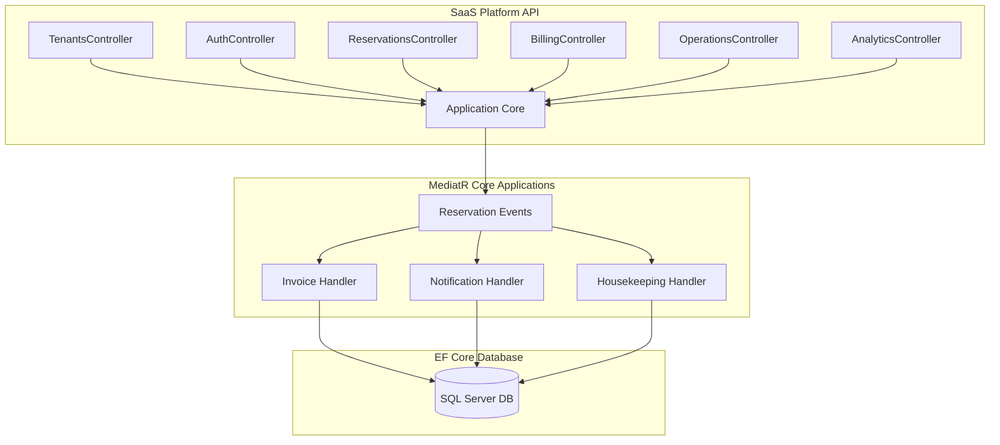

# Resort & Chalet Management SaaS Platform

A production-ready, highly scalable multi-tenant Software-as-a-Service (SaaS) platform built for managing Resorts, Chalets, Villas, Hotel Rooms, Reservations, Payments, CRM, Operations, Housekeeping, Maintenance, and Analytics.

This platform implements a robust **Clean Architecture** along with **CQRS (MediatR)**, securing data isolation per tenant in a shared database schema.

---

## 1. Technology Stack

* **Language/Framework**: ASP.NET Core 9.0 Web API
* **Architecture**: Clean Architecture, CQRS (MediatR), Domain-Driven Design (DDD)
* **Database & ORM**: Entity Framework Core 9.0, MS SQL Server
* **Authentication**: JWT (JSON Web Tokens), Refresh Tokens, Claims-based Authorization
* **Background Tasks**: Hangfire / MediatR Events
* **Logging & Telemetry**: Serilog structured logging
* **DevOps**: Docker, Docker Compose, GitHub Actions (CI)
* **Documentation**: Swagger/OpenAPI v7.0.0

---

## 2. Multi-Tenant Architecture & Data Isolation

The platform employs a **Shared Database, Shared Schema** isolation strategy. All tenant-specific operational tables implement `IMustHaveTenant` and are isolated logically:

* **Automated Injection**: The DB save pipeline (`ApplicationDbContext.SaveChangesAsync`) automatically injects the active tenant's context (`TenantId`) into all added entities.
* **Global Query Filtering**: Inward entity queries automatically apply a global query filter `e.TenantId == CurrentTenantId` to prevent cross-tenant data leaks.
* **Soft Delete Isolation**: Standard database deletes are converted to soft-deletes (`IsDeleted = true`), retaining history logs while omitting deleted items from active queries.

---

## 3. Visual Domain Structure



---

## 4. Platform Modules & Features

### 4.1. Identity & Access Management (IAM)
* Secure PBKDF2 hashing engine for passwords.
* Claims-based JWT validation with granular permissions checking.
* Refresh Token tracking for secure, persistent user sessions.

### 4.2. Property & Inventory Management
* Layered inventory structure: Resorts -> Buildings -> Floors -> Units.
* Unit categorisation using Unit Types (e.g. Deluxe Pool Villa, Double Bed Room).
* Amenity tracking and image metadata management.

### 4.3. CRM & Customer Profiles
* Centralized guest directory featuring documents logging (National ID, Passports) and custom operational notes.

### 4.4. Reservations & Dynamic Pricing Engine
* Double-booking prevention algorithm using overlapping date range validations.
* Dynamic stay-rate computations: adjusts base pricing based on active seasons, weekend markups, and specific holiday rules.
* Tracks reservation status transitions (Draft -> Pending -> Confirmed -> CheckedIn -> CheckedOut -> Cancelled).

### 4.5. Operations, Housekeeping & Maintenance
* Automatically marks units dirty upon guest check-out, triggering a new housekeeping task.
* Manages staff work assignments and resolves repair tickets.
* Critical and high-priority maintenance requests automatically set units to "OutOfService" to block new reservations.

### 4.6. Billing, Invoices & Payments
* Reservation creation automatically triggers invoice generation.
* Processes secure credit card, cash, and bank transfer payments.
* Successful full-payment matching transitions invoices to "Paid" and automatically updates reservation status to "Confirmed".

### 4.7. Operational Dashboard & Analytics
* Delivers live metrics for resort operations: Total Revenue, Pending Revenue, Occupancy Rate (percentage), Total Reservations, Active Maintenance Tickets, and Dirty Units Count.

---

## 5. Directory Structure

```text
src/
├── ResortManagement.Domain/         # Entities, Value Objects, Domain Events, Common Interfaces
├── ResortManagement.Application/    # Use Cases, MediatR Commands/Queries, Exceptions, Interfaces
├── ResortManagement.Infrastructure/ # ApplicationDbContext, Services, Security, Logging, Migrations
└── ResortManagement.WebApi/         # Controllers, Middlewares, API Versioning, Swagger configuration
```

---

## 6. Setup & Execution

### Prerequisites
* .NET SDK 9.0 or higher
* SQL Server LocalDB or full MS SQL Server instance
* Docker Desktop (optional, for containerised run)

### Method 1: Local Development (.NET CLI)

1. **Restore dependencies**:
   ```bash
   dotnet restore
   ```
2. **Apply migrations & build**:
   ```bash
   dotnet build
   ```
3. **Run the API**:
   ```bash
   dotnet run --project src/ResortManagement.WebApi/ResortManagement.WebApi.csproj
   ```
4. Access Swagger documentation at: `https://localhost:5001/swagger` (or matching HTTP dev port).

### Method 2: Docker Compose

Execute the multi-service system grid including SQL Server and the Web API:

```bash
docker-compose up --build
```

* API will be exposed at: `http://localhost:8080`
* SQL Server will be exposed at: `localhost:1433`

---

## 7. Automated CI Pipeline
A GitHub Actions workflow is pre-configured in `.github/workflows/ci.yml`. On every push or pull request to the main branches, the pipeline will:
1. Setup the .NET 9 environment.
2. Restore package dependencies.
3. Compile the solution.
4. Execute all automated tests.
