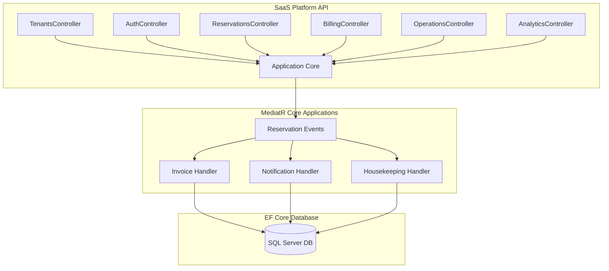

# Resort & Chalet Management SaaS Platform

A production-ready, highly scalable multi-tenant Software-as-a-Service (SaaS) platform built for managing Resorts, Chalets, Villas, Hotel Rooms, Reservations, Payments, CRM, Operations, Housekeeping, Maintenance, and Analytics.

This platform implements a robust **Clean Architecture** along with **CQRS (MediatR)**, securing absolute data isolation per tenant in a shared database schema.

---

## 1. Technology Stack

* **Language/Framework**: ASP.NET Core 9.0 Web API & MVC
* **Architecture**: Clean Architecture, CQRS (MediatR), Domain-Driven Design (DDD)
* **Database & ORM**: Entity Framework Core 9.0, MS SQL Server
* **Authentication**: JWT (JSON Web Tokens), Cookie Authentication Scheme, Refresh Tokens, Claims-based & Role-Based Access Control (RBAC)
* **Background Tasks**: Hangfire / MediatR Events / Domain Event Dispatchers
* **Logging & Telemetry**: Serilog structured logging
* **DevOps**: Docker, Docker Compose, GitHub Actions (CI/CD)
* **Documentation**: Swagger/OpenAPI v7.0.0

---

## 2. Multi-Tenant Architecture & Data Isolation

The platform employs a **Shared Database, Shared Schema** isolation strategy. All tenant-specific operational tables implement `IMustHaveTenant` and are isolated logically:

* **Automated Tenant Injection**: The DB save pipeline (`ApplicationDbContext.SaveChangesAsync`) automatically injects the active tenant's context (`TenantId`) into all added entities using `ITenantProvider`.
* **Global Query Filtering**: Inward entity queries automatically apply a global query filter `e.TenantId == CurrentTenantId` to prevent cross-tenant data leaks.
* **Soft Delete Isolation**: Standard database deletes are converted to soft-deletes (`IsDeleted = true`), retaining history logs while omitting deleted items from active queries.

---

## 3. Visual Domain Structure



---

## 4. Platform Modules & Features (Fully Dynamic)

### 4.1. Identity, Access Management & RBAC Enforcement
* Secure PBKDF2 hashing engine for passwords.
* Claims-based JWT validation with granular permissions checking.
* Standard Role-Based Access Control (RBAC) mapped directly to cookie identity session using standard `ClaimTypes.Role` claims.
* High-security Claims Injection on simulated Social Logins (OAuth Google/Facebook callbacks) and real-time profile updates.
* Restricted access paths correctly gating Administrator, Operations Manager, and Receptionist roles with automatic 403 Forbidden redirects for restricted employees.

### 4.2. Interactive Property & Inventory Catalog
* Layered inventory structure: Resorts -> Buildings -> Floors -> Units.
* **Dynamic Sidebar Filter Panel**: Enforces real-time, client-side, animated card filtering:
  * *Status Filters*: Live computed counts for Available, Occupied, and Maintenance units.
  * *Location Tags*: Generates interactive tags representing active destinations. Clicking tags instantly filters units by location.
  * *Bedrooms Slider*: Automatically matches bounds based on room capacities.
  * *Search-as-you-type*: Text query searching through unit numbers, type names, and resort addresses.
* Center-aligned glassmorphic empty-state fallbacks dynamically triggered when active filters return zero matches.

### 4.3. Administrative Asset Creation (Context-Aware)
* **Property Registration**: Glassmorphic form to register resorts. Automatically provisions baseline structures (provisions building "Main Lodge" and Floor "1") to simplify assigning rooms.
* **Room Type Creation**: Provisions Room Types (Base Price, Capacity templates) mapped to specific resorts.
* **Smart Unit Registration**: Context-aware dropdown filtering. Selecting a target resort dynamically filters available Room Type templates in real-time, preventing invalid room assignments.

### 4.4. CRM, Guest Relations & Loyalty
* Centralized guest directory featuring documents logging (National ID, Passports) and custom operational notes.
* Dynamic calculations of overall guest metrics: Total Guest registry, Platinum guest tier ratio, and Average Guest Spend calculated dynamically from paid database invoices.
* Live individual customer card calculations: aggregates total paid invoice amounts to show accurate lifetime spends per guest.

### 5.5. Reservations & Dynamic Pricing Engine
* Double-booking prevention algorithm using overlapping date range validations.
* Dynamic stay-rate computations: adjusts base pricing based on active seasons, weekend markups, and specific holiday rules.
* Tracks reservation status transitions (Draft -> Pending -> Confirmed -> CheckedIn -> CheckedOut -> Cancelled).

### 4.6. Operations, Housekeeping & Maintenance
* Automatically marks units dirty upon guest check-out, triggering a new housekeeping task.
* Manages staff work assignments and resolves repair tickets.
* Critical and high-priority maintenance requests automatically set units to "OutOfService" to block new reservations.

### 4.7. Billing, Invoices & Payments (Live Ledgers)
* Reservation creation automatically triggers invoice generation.
* Successful full-payment matching transitions invoices to "Paid" and automatically updates reservation status to "Confirmed".
* Dynamic ADR (Average Daily Rate) and RevPAR (Revenue Per Available Room) calculated live from SQL Server aggregates.
* **6-Month Visual Analytics**: Dynamic Chart.js financial data fed by monthly revenue aggregations.
* **Dynamic Activity Feed**: Real-time activity timeline displaying invoice creation and transaction logs.

### 4.8. Premium Information Pages
* **Privacy Policy (`/privacy`)**: Responsive layout outlining data protection, cryptographic password standards, and schema isolation.
* **Terms of Service (`/terms`)**: Service licensing parameters, acceptable usage, and SaaS billing agreements.
* **Developer API Docs (`/api-docs`)**: Dark-themed, monospace-styled technical specification detailing REST endpoints (POST `/api/v1/auth/login`, GET `/api/v1/resorts`), JWT auth headers, and Smart Lock integration webhooks.
* **Concierge Support Center (`/support`)**: Live ticket dispatch portal with an interactive support form and dispatch success notifications.

### 4.9. 100% Real-Time Interactive Notifications Hub
* **Automated Activity Logs**: Real-time activity telemetry that manages tenant contexts safely.
* **WhatsApp Interactive Message Feed**: Live, chat-bubble conversation layout allowing staff to type and dispatch responses directly to guests with sound effects, loading indicators, and delivered checks.
* **Synthesized Web Audio Engine**: Synthesizes custom high-end luxury chimes (sine-wave frequency sweep double-chime) and message sending "swooshes" locally in the browser, completely independent of external static audio files.
* **Interactive Action Widgets**: A rich concierge mail workspace allowing immediate responses to emails, logging outgoing messages safely, and Emergency Dispatch checklists.
* **Floating Toast Notification Center**: Displays sliding toast notifications in the bottom-right corner for any newly arrived DB record, featuring an automatic 8-second dismiss timer.

### 4.10. Settings Suite & Profile Customization
* **Profile picture upload**: Upload images locally to `wwwroot/uploads/profiles/`.
* **Thread-safe local store**: Thread-safe persistent JSON-based mapping store (`avatars.json`) to retain customized profile images at startup.
* **Real-time cookie updating**: Updates active browser session claims using `HttpContext.SignInAsync` immediately upon profile picture upload or details modification.
* **Interactive Team Roster Directory**: Beautiful staff directory with search-as-you-type filtering, department dropdown categories, and a premium modal form to register staff members with temporary credentials.
* **Secure password changer**: Leverages native ASP.NET Core password hashing algorithms to verify current passwords and securely store updated hashes in SQL Server.

### 4.11. Dynamic 7-Day Reservation Timeline
* **Gantt timeline availability**: 7-day visual reservation timeline mapping active room bookings.
* **C# date arithmetic positioners**: Calculates and renders stay bars dynamically based on date boundaries.
* **AJAX workflow endpoints**: Instantly change booking status (Check-in, Check-out, Cancel) via AJAX POST requests inside a glassmorphic detail pop-up modal.
* **Google Calendar feed integration**: Standard iCalendar (`.ics` RFC 5545) subscription feeds natively linking resorts to any calendar sync platform.

---

## 5. MVC Page Controller Role Mapping

Enforces granular Role-Based Access Control (RBAC) across all frontend management portals and MVC views:

| Controller / Endpoint | Required Roles / Access level | Description & Purpose |
| :--- | :--- | :--- |
| **`DashboardController`** | All authenticated staff (`[Authorize]`) | General resort operational performance summary. |
| **`GuestsController`** | `Administrator`, `Operations Manager`, `Receptionist` | CRM, guest personal information, and cumulative loyalty spends. |
| **`BillingController`** | `Administrator`, `Operations Manager` | Sensitive financial ledger, billing stats, invoices, and transaction logs. |
| **`BookingsController`** | `Administrator`, `Operations Manager`, `Receptionist` | Reservation desk, room assignments, checking in/out guests. |
| **`OperationsController`** | `Administrator`, `Operations Manager`, `Receptionist` | Property operations, live housekeeping tasks, and maintenance requests. |
| **`AnalyticsController`** | `Administrator`, `Operations Manager` | Executive-level operations forecasting and charts analytics. |
| **`OwnerController`** | `Administrator`, `Operations Manager` | Executive developer owner metrics, property yield, expenditures, and net income. |
| **`CalendarController`** | `Administrator`, `Operations Manager`, `Receptionist` | Interactive visual reservation planner and availability calendar. |
| **`ResortsController`** | Portfolio catalog is public to all staff (`[Authorize]`); creation is restricted to `Administrator`, `Operations Manager` | General staff can view property catalog; only administrators can create new Resorts, Room Types, and Chalets. |

---

## 6. Directory Structure

```text
src/
├── ResortManagement.Domain/         # Entities, Value Objects, Domain Events, Common Interfaces
├── ResortManagement.Application/    # Use Cases, MediatR Commands/Queries, Exceptions, Interfaces
├── ResortManagement.Infrastructure/ # ApplicationDbContext, Services, Security, Logging, Migrations
├── ResortManagement.WebApi/         # MVC/WebAPI Controllers, Web views, Middlewares, Program.cs
└── ResortManagement.Tests/          # Unit & Integration tests for Core Business Logic
```

---

## 7. Setup & Execution

### Prerequisites
* .NET SDK 9.0 or higher
* SQL Server LocalDB or full MS SQL Server instance
* Docker Desktop (optional, for containerised run)

### Method 1: Local Development (.NET CLI)

1. **Restore dependencies**:
   ```bash
   dotnet restore
   ```
2. **Apply migrations & build**:
   ```bash
   dotnet build
   ```
3. **Run the API**:
   ```bash
   dotnet run --project src/ResortManagement.WebApi/ResortManagement.WebApi.csproj --launch-profile https
   ```
4. Access the portal at: `https://localhost:7282` or Web API Swagger at: `https://localhost:7282/swagger`.

### Default Employee Login Credentials (Seeded)

The database automatically seeds standard test roles across distinct employee access scopes:

| Email | Password | Mapped Role | Access Level |
| :--- | :--- | :--- | :--- |
| `admin@chaletelite.com` | `admin123` | `Administrator` | Full System Root Access |
| `manager@chaletelite.com` | `manager123` | `Operations Manager` | Operational Executive Access |
| `frontdesk@chaletelite.com` | `frontdesk123` | `Receptionist` | Operations Frontdesk Access |
| `cleaner@chaletelite.com` | `cleaner123` | `Housekeeper` | Operational Cleaning Access |
| `tech@chaletelite.com` | `tech123` | `Maintenance Technician` | Operational Repair Access |

---

## 8. Automated CI Pipeline

A GitHub Actions workflow is pre-configured in `.github/workflows/ci.yml`. On every push or pull request to the main branches, the pipeline will:
1. Setup the .NET 9 environment.
2. Restore package dependencies.
3. Compile the solution.
4. Execute all automated tests.
